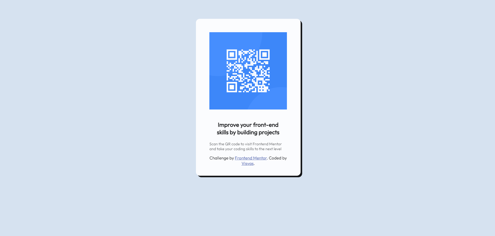

# Frontend Mentor - QR code component solution

This is a solution to the [QR code component challenge on Frontend Mentor](https://www.frontendmentor.io/challenges/qr-code-component-iux_sIO_H). Frontend Mentor challenges help you improve your coding skills by building realistic projects. 

## Table of contents

- [Overview](#overview)
  - [Screenshot](#screenshot)
  - [Links](#links)
- [My process](#my-process)
  - [Built with](#built-with)
  - [What I learned](#what-i-learned)
  - [Continued development](#continued-development)
  - [Useful resources](#useful-resources)
- [Author](#author)


## Overview

### Screenshot



### Links

- Solution URL: [Solution URL](https://github.com/Visvas07/QR-CODE)
- Live Site URL: [Live URL](https://visvas07.github.io/QR-CODE/index.html)

## My process

### Built with

- Semantic HTML5 markup
- CSS custom properties
- Flexbox

### What I learned

To see how you can add code snippets, see below:

```css
/*---gives the card view which enables to stay the same in mobile view---*/
  .card{
    background-color: #fff;
    border-radius: 10px;
    padding: 25px;
    max-width: 220px;
    width: 100%;
    margin :auto;
    opacity: 0.9;
    box-shadow: 4px 4px;
}
```


### Continued development

I plan to use this as a practise to build good product cards which can be widely used.


### Useful resources

- [W3 Schools](https://www.w3schools.com) - This helped me for refreshing my HTML and CSS knowledge. If you ever want a refresher, you can use this

## Author

- Website - [Visvas Nagarajan](https://www.visvas-tech.com)
- Frontend Mentor - [@yourusername](https://www.frontendmentor.io/profile/Visvas07)
